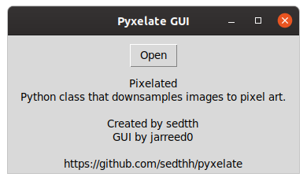
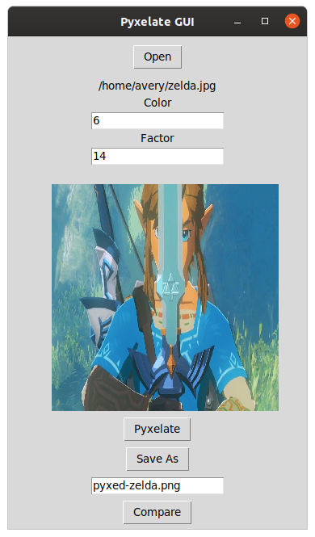
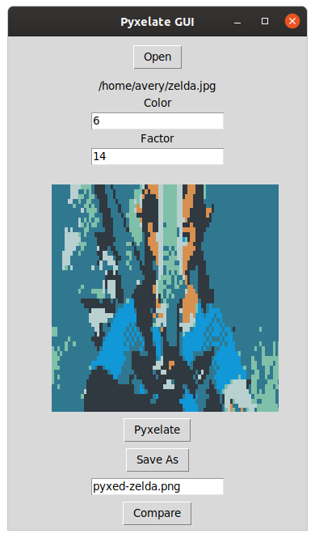
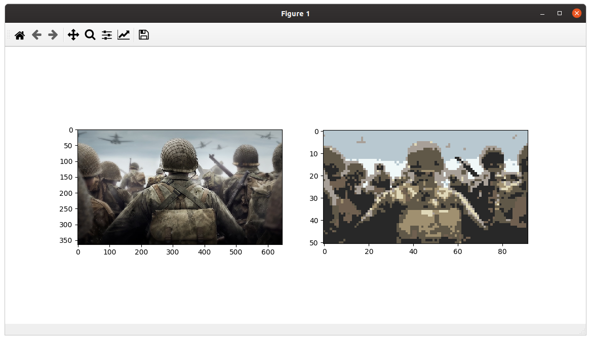

# Gui for Pyxelate

downsamples images into 8-bit pixel art

[pyxelate repo by sedthh](https://github.com/sedthh/pyxelate/)

###Installation
```
pip3 install git+https://github.com/sedthh/pyxelate.git
sudo apt-get install python3-tk python3-pil python3-pil.imagetk
```








